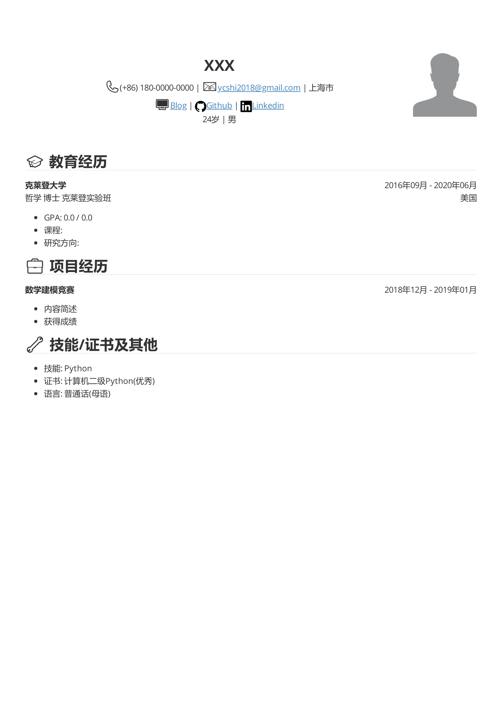
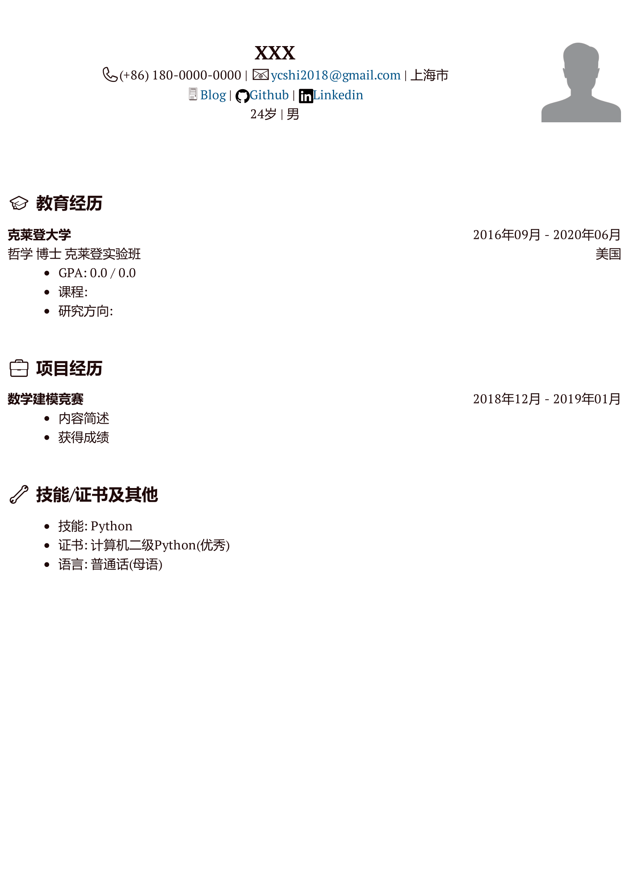
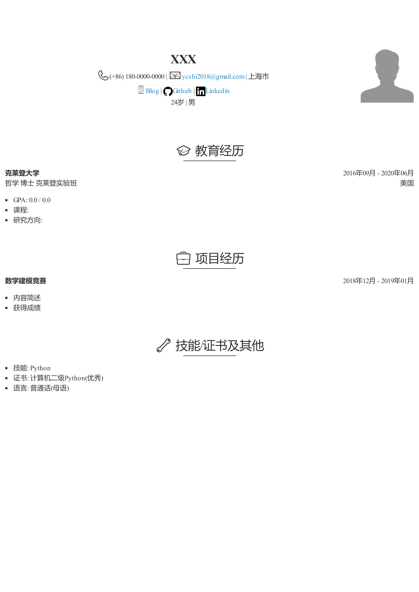
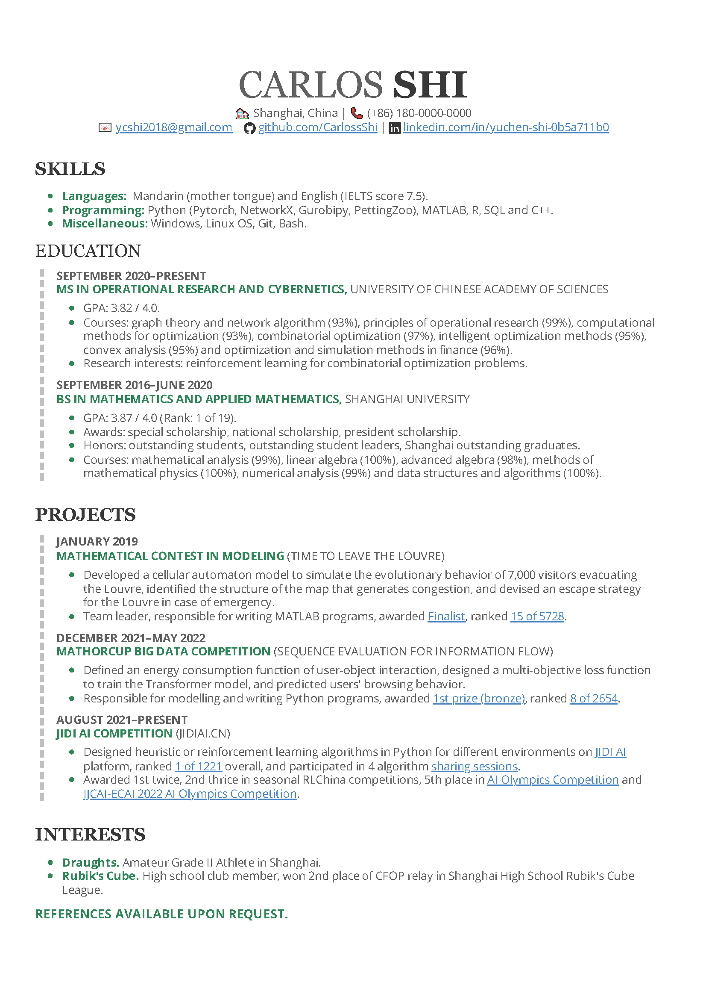

# markdown-resume

Markdown中英文简历模板.

# 如何使用

1. 下载[Typora](https://typora.io/) (也可使用其他Markdown编辑器), 但不保证导出效果与下文一致.
2. 修改`resume-zh.md`或`resume-en`中的内容:

   - 对于中文简历 (`resume-zh`) , 将照片放入`assets`文件夹中, 并相应修改``中的名称及长宽, 建议设置高度大于100, 否则文字无法对齐;
   - 补充剩余内容.
3. 添加表情:

   - 在Markdown语言中添加表情. 首先在[Emoji Cheat Sheet](https://www.webfx.com/tools/emoji-cheat-sheet/)中找到想要的表情, 如mortar board:mortar_board: , 其名称为mortar_board, 随后直接键入`:mortar_board:`.

   - 在HTML语言中添加表情. 首先在[Full Emoji List](https://unicode.org/emoji/charts/full-emoji-list.html)中找到想要的表情, 如desktop computer&#x1F5A5;, 其代码为[U+1F5A5](https://unicode.org/emoji/charts/full-emoji-list.html#1f5a5), 随后将`1F5A5`填至相应位置, 如`&#x1F5A5;`; 若无法找到想要的表情, 则在[Simple Icons](https://simpleicons.org/)等网站中寻找并下载至`assets`文件夹中, 如下载`github.svg`, 并相应修改`img src="assets/github.svg" width="18px">`中的名称及大小.
4. 添加主题: 对于英文简历 (`resume-en`), 首先进入`文件`→`外观`→`打开主题文件夹`将项目中的`cs.css`文件放入该文件夹, 该文件修改自`github.css`.
5. 导出:
   1. 进入`文件`→ `偏好设置`→`导出`;
   2. 按底部加号:heavy_plus_sign:, 选择`PDF (Typora / Webkit)`后点击`添加`, 并修改命名;
   3. 设置`页边距`为`自定义`, 设置`上下左右侧页边距`如`14, -10, 2, 2`;
   4. 对于中文简历 (`resume-zh`) , 选择`主题`为`Github, Newsprint, Whitey`中的其中一个, 推荐使用`Github`主题, 也可在[Typora Themes](https://theme.typora.io/)中下载其他主题; 对于英文简历 (`resume-en`) , 选择刚才添加的`Cv`主题;
   5. 依次点击`文件`→`导出`再选择刚才添加的导出方式即可导出`pdf`文件.

# 效果

按照上述设置, 依次选择`Github, Newsprint, Whitey`导出的`resume-zh`和选择`Cv`主题导出的`resume-en`效果如下:

|  |  |  |  |
| ------------------------------------------ | ------------------------------------------------ | ------------------------------------------ | ----------------------------------------- |

# Acknowledgments

- [超级简历 - WonderCV](https://www.wondercv.com/)
- [CyC2018](https://github.com/CyC2018)/**[Markdown-Resume](https://github.com/CyC2018/Markdown-Resume)**
- [Chinese Resume Template（中文简历模板）](https://www.overleaf.com/latex/templates/chinese-resume-template-zhong-wen-jian-li-mo-ban/fbdypsjmgwbb)
- [Graduate CV template - TargetJobs](https://targetjobs.co.uk/static/64566d7e52c2e5864fb546874bfe0e14/graduate-cv-template.pdf)

